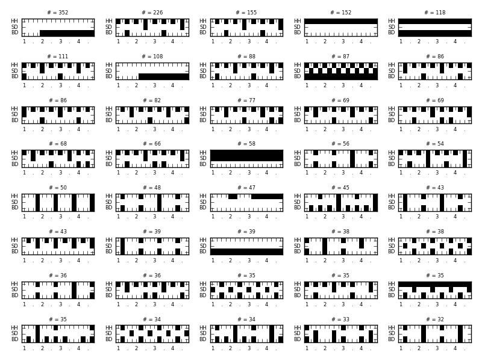
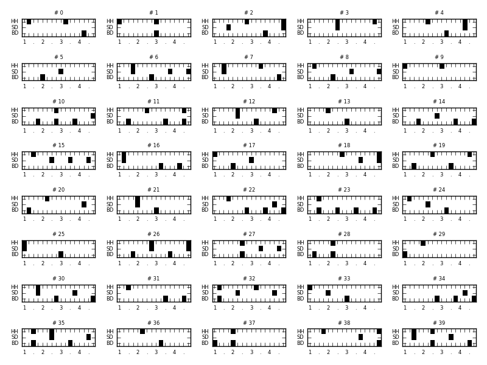

# Drum-Groove extraction

## Steps

### Exploration

- write a wrapper for pyguitarpro to parse a collection of > 50,000 Guitar Pro files (gp3, gp4, gp5)
- extract subpatterns of 1 bar length
- quantize to 16th note grid
- focus on songs in 4/4 time signature
- map drum instruments to 3 classes
  1. hi-hat / cymbals
  2. snare drum
  3. bass drum
- convert each bass loop (3 x 16 bits) into int64 integer
- parse all songs and collect patterns that occur more than once
- in total we have 8,8 mio bars so far (that's not all!)

### Generation

- take first 10,000 bars
- train Recurrent Neural Network (very simple, one LSTM layer, 256 units) to predict current bar of drum track from previous 10 bars
- here's a sequence of prediction (still not very interesting but something is happening ;)

